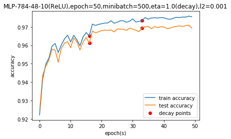

# MLP-NumPy
Multi-layer Perceptron implemented by NumPy.

# Network Configuration

Config your network at ```config.py```

# Run
```
python3 main.py
```

# Result

Using one 48-neuron hidden layer with L2 regularization, my MLP can achieve ~97% test accuracy on MNIST dataset



# Author
Ziping Chen, March 2020
